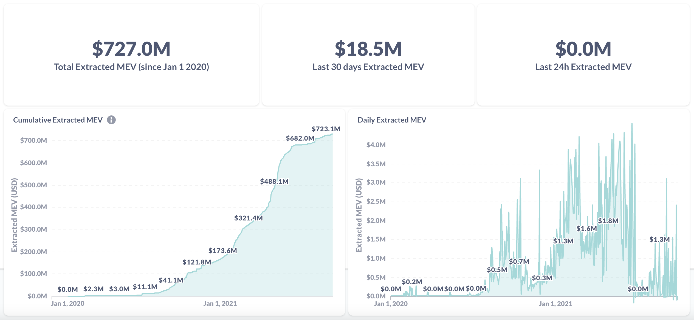
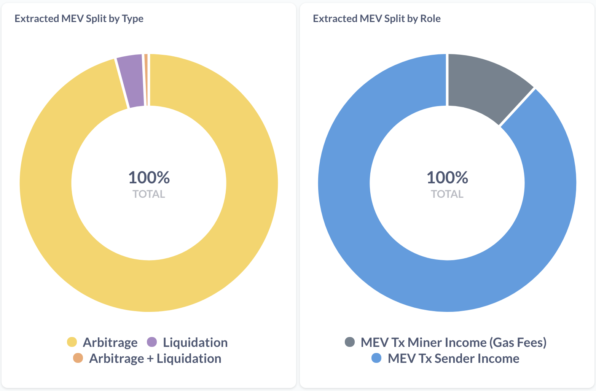

# Introduction

##  Introduction 

This is a public resource for learning about **MEV \(Maximal Extractable Value\).**

We cover a range of topics including the key concepts, research on this the topic, different approaches to tackling this issue by various projects out there. 


Find any errors or wants to share your opinions?  
See how you can contribute [here](contributions.md).


### What is MEV?

Maximal \(formerly "miner" in the context of Proof of Work\) extractable value \(MEV\) refers to the maximum value that can be extracted from block production in excess of the standard block reward and gas fees by censoring and/or changing the order of transactions in a block.

When someone sends a transaction in the blockchain, there is a delay between the time when the transaction is being broadcast to the network and when it is actually mined into a block. During this period, transactions sit in a pending transaction pool called the mempool where contents are visible to everyone. Arbitrageurs and miners can monitor the mempool and find opportunities to maximize their own profits e.g. by frontrunning transactions. If a front-runner is a miner, they can also reorder or even censor transactions. MEV income can also be shared with non-miners and traders who participate in some profit sharing schemes within the category of [FaaS/MEVA](solutions/faas-or-meva/).

### Why does this matter?[¹](https://research.paradigm.xyz/MEV)

#### MEV can harm users

MEV is an invisible tax that miners can collect from users.

#### MEV can destabilize Ethereum

If block rewards are small enough compared to MEV, it can be rational for miners to destabilize consensus by reordering or censoring transactions.

### Just how bad is the problem? 

You can use the [Flashbots Dashboard ](https://explore.flashbots.net/)to track Extracted MEV to better assess this worsening trend in real-time.

It is estimated that more than $727M of MEV has been extracted since 1st January 2020.

The majority of extracted MEV tend to be from [Arbitrage](terms-and-concepts/arbitrage.md) opportunities on various [AMMs](terms-and-concepts/automated-market-maker.md), with a large percentage of income going to searchers, bots and participants in profit sharing MEV infrastructures \(eg. [Flashbot's](solutions/faas-or-meva/flashbots.md) MEV-GETH\)

Another useful tracker for gas consumption of back-running bots:  [Dune Analytics](https://duneanalytics.com/phabc/backrunning-bots-gas-consumption) provides very detailed statistics on this worsening MEV situation.


**Link:**  
According to [https://research.paradigm.xyz/MEV](https://research.paradigm.xyz/MEV) ↩¹


